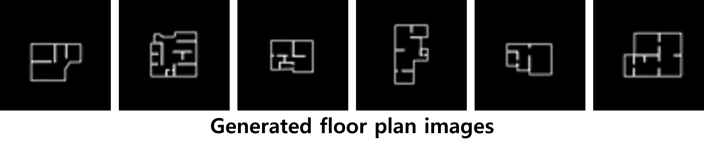
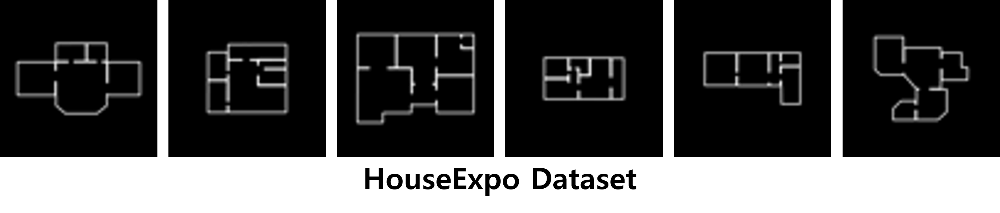
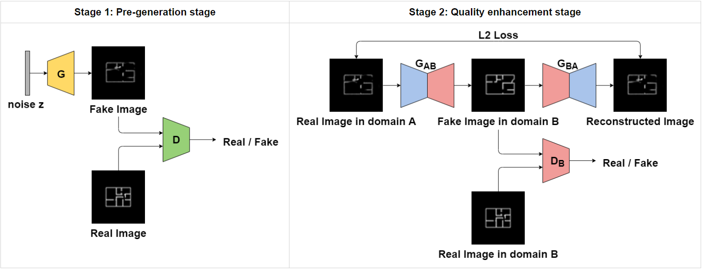
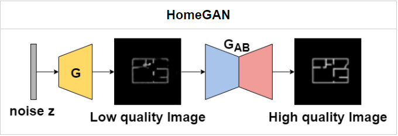
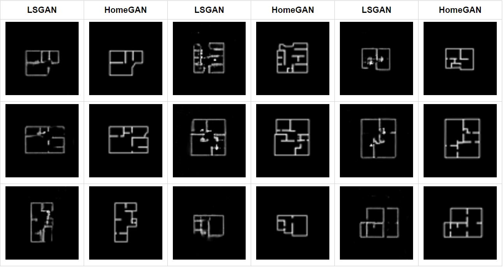
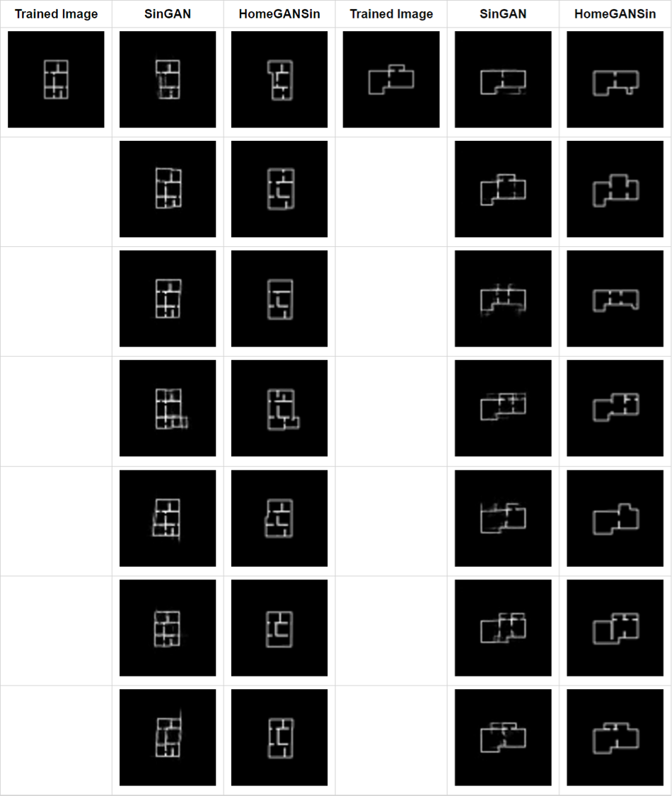

# HomeGAN

### Official PyTorch implementation of the paper: "HomeGAN: Two stage GAN for enhanced floor plan image generation"
#### KCC 2020 paper

## Generate floor plan image from a random noise
With HomeGAN which compose of LSGAN and CycleGAN you can train a generative model using HouseExpo dataset and then generate floor plan image from a random noise, for example:
<p align="center">
    
</p>

## Dataset
We used binary floor plan images generated from HouseExpo dataset to train HomeGAN.
HouseExpo dataset is JSON file which contains 'verts', 'id', 'room_category', 'room_num', 'bbox' as keys.
We used only 'verts', 'id', and 'bbox' since 'room_category' and 'room_num' seems not accurate.
'bbox' contains info of min, max (x, y) coordinates of bounding box and 'verts' consists of vertices of floor plan image.
The following explanation describes the data preprocessing method.

- We scaled up every coordinate value by a factor of 100.
- We pasted the white lines representing the houses onto a black background to create a binary image.
- To reduce the range of image sizes, we limited the size of the largest image to 2700 and do not use images that exceed the range.

You can check [original repo](https://github.com/TeaganLi/HouseExpo) to get more information of original HouseExpo dataset.
<p align="center">
    
</p>

## Model architecture
HomeGAN consists of two stages, _Stage1: Pre-generation stage_ and _Stage 2: Quality enhancement stage_.
<p align="center">
    
</p>

- Stage 1: Pre-generation stage
  - We used LSGAN to train stage 1.
  - Stage 1 produces incomplete floor plan images.


- Stage 2: Quality enhancement stage
  - We used CycleGAN to train stage 2.
  - Stage 2 produces enhanced complete drawings.

After finish training, you can use HomeGAN to generate random floor plan images.
<p align="center">
    
</p>

## Results
Here, the results of generating floor plan images using simple LSGAN and those using HomeGAN are compared.
<p align="center">
    
</p>

## Additional work - HomeGANSin
Using the same idea, we can build a model, this time replacing LSGAN with SinGAN.
SinGAN is a model which can train a generative model from a single natural image, and then generate random samples from the given image.
Now we can generate random floor plan image samples from the given floor plan image.
<p align="center">
    
</p>

### Citation
If you use this code for your research, please cite our paper:

```
@inproceedings{kim2020homegan,
  title={HomeGAN: Two stage GAN for enhanced floor plan image generation},
  author={Kim, Yong Hyun and Ohn, Syng-Yup},
  booktitle={2020 Korea Computer Congress (KCC)}
}
```
